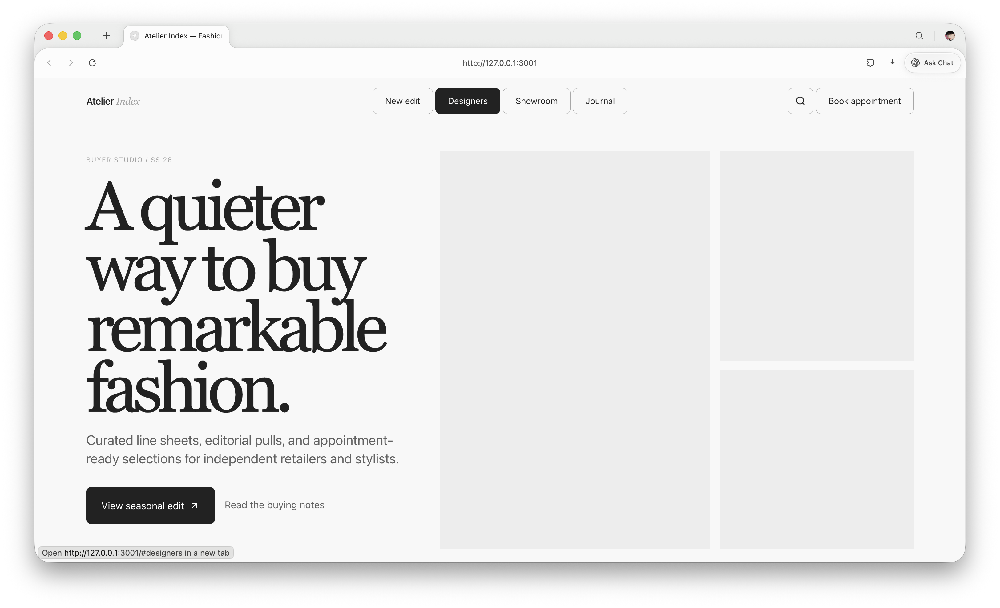
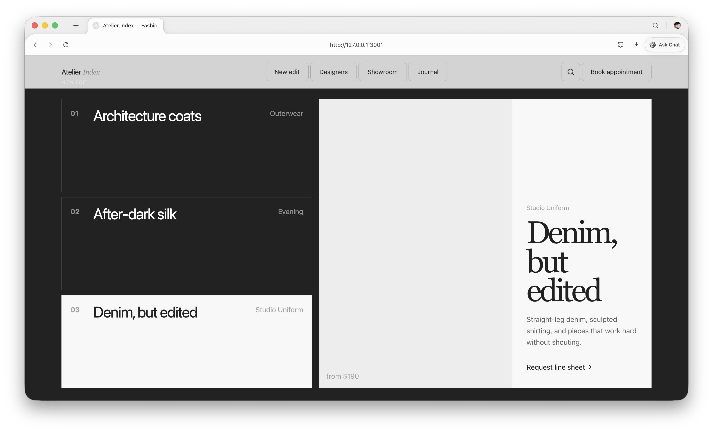
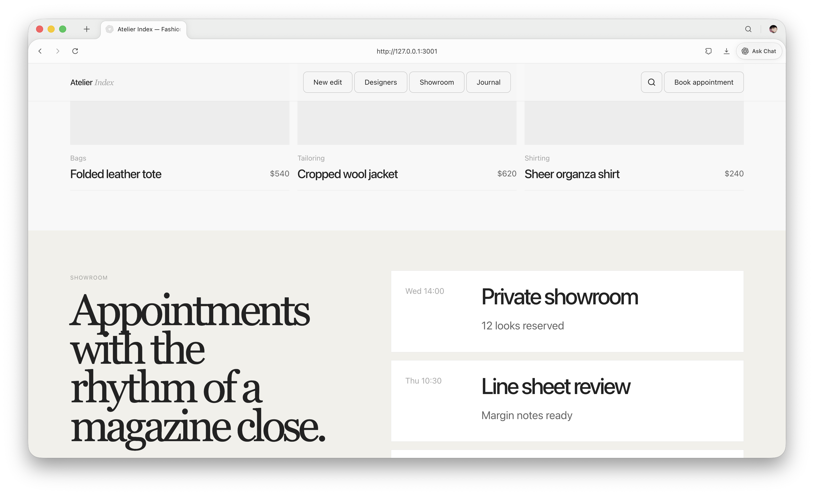
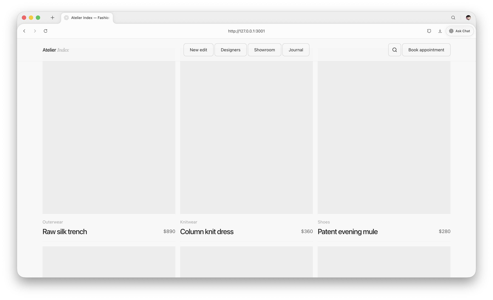

# Editorial UI Design Tokens

Editorial UI Design Tokens is a small open-source design-token system for building refined, magazine-like websites with strong typography, quiet surfaces, precise spacing, responsive editorial grids, stable interaction panels, and copyright-safe image placeholders.

It is designed for landing pages, buyer portals, creative studios, galleries, fashion/editorial showcases, product launches, and any frontend that should feel curated rather than generic.

[Open the standalone showcase](./showcase.html) or view it on GitHub Pages: https://eliodengdeng.github.io/editorial-ui-design-tokens/showcase.html

## Showcase

The included showcase demonstrates that these tokens can create a complete, polished website without bundling licensed photography. All media areas use base-only placeholder surfaces, so the demo is safe to publish and adapt.









## Style Summary

This system creates a restrained editorial interface style:

- **Magazine typography**: oversized serif display headlines paired with clean sans UI labels.
- **Quiet luxury surfaces**: paper gray, ink black, stone/sand feature sections, and minimal accent color.
- **Square media rhythm**: image areas are structural blocks, usually square-edged and calm.
- **Base-only placeholders**: no AI-looking artwork, fake icons, crop marks, skeleton bars, or decorative lines.
- **Tactile interaction**: buttons invert, tabs change state quickly, and panels crossfade without layout jumps.
- **Responsive editorial grids**: desktop layouts use asymmetric split compositions; mobile collapses into readable, scrollable flows.

## What You Can Build With It

Use the tokens to build websites with a similar editorial effect:

- fashion studio / buyer websites
- portfolio and gallery pages
- design studio landing pages
- product launch microsites
- creative SaaS homepages
- premium documentation or brand systems

The included `showcase.html` is a reference implementation. It demonstrates header navigation, hero composition, tabbed editorial panels, product cards, placeholder media, showroom cards, and responsive adaptation.

## Files

| File | Purpose |
| --- | --- |
| `tokens.css` | CSS custom properties for typography, color, spacing, layout, radius, components, placeholders, and motion |
| `tailwind.preset.ts` | Tailwind extension that maps core Editorial UI tokens to utilities |
| `showcase.html` | Standalone demo website using only placeholders; no image licensing needed |
| `docs/images/*` | Screenshots of the showcase for README/documentation |
| `README.md` | Usage rules and reusable interaction patterns |

## Quick Start

### CSS

```css
@import "./editorial-ui-design-tokens/tokens.css";

body {
  background: var(--eui-surface-page);
  color: var(--eui-text-primary);
  font-family: var(--eui-font-sans);
}
```

### Tailwind

```ts
import editorialUiPreset from "./editorial-ui-design-tokens/tailwind.preset";

export default {
  presets: [editorialUiPreset],
  content: ["./app/**/*.{ts,tsx}", "./components/**/*.{ts,tsx}"],
};
```

### Preview the showcase

```bash
cd editorial-ui-design-tokens
python3 -m http.server 8123
# open http://127.0.0.1:8123/showcase.html
```

## Responsive Support

The tokens include responsive shell, gutter, section, and stable-panel values. The showcase adapts from wide editorial compositions to mobile-friendly stacked layouts and horizontal product rails.

Key responsive tokens:

- `--eui-shell-content`
- `--eui-shell-mobile`
- `--eui-layout-gutter-desktop`
- `--eui-layout-gutter-mobile`
- `--eui-section-padding-y`
- `--eui-section-padding-y-mobile`
- `--eui-stable-panel-height`
- `--eui-stable-panel-height-mobile`

## Token Naming

Editorial UI Design Tokens uses the `--eui-*` prefix.

| Layer | Example | Use |
| --- | --- | --- |
| Primitive | `--eui-color-orange`, `--eui-space-6` | Raw foundations |
| Semantic | `--eui-text-secondary`, `--eui-surface-page` | Product roles |
| Component | `--eui-button-height-md`, `--eui-agent-radius` | Reusable component geometry |
| Motion | `--eui-motion-panel`, `--eui-ease-out` | Timing, easing, stagger, transitions |

Prefer semantic tokens in components. Reach for primitives only when defining a new semantic role.

## Typography

Use `--eui-font-display` for hero and section headlines. Keep display type large, low in weight, and tightly tracked. Use `--eui-font-sans` for product UI and Latin body copy. Use `--eui-font-cjk` for Chinese or mixed Chinese/English interfaces.

Recommended hierarchy:

| Role | Token |
| --- | --- |
| Hero title | `--eui-type-display-xl-*` |
| Section title | `--eui-type-display-lg-*` or `--eui-type-heading-lg-*` |
| Card title | `--eui-type-heading-sm-*` or `--eui-type-heading-md-*` |
| Intro/body copy | `--eui-type-body-lg-*`, `--eui-type-body-md-*` |
| Dense UI copy | `--eui-type-body-sm-*`, `--eui-type-caption-*` |
| Metadata/eyebrows | `--eui-type-eyebrow-*` |

Use `text-wrap: pretty` or `balance` for major headings. Avoid viewport-scaled type outside controlled `clamp()` ranges.

## Color

The default color model is not pink and not a single-hue system. It starts with paper gray and ink, uses a quiet stone/sand featured surface, then adds warm orange and several small category accents.

| Role | Token |
| --- | --- |
| Page background | `--eui-surface-page` |
| Default text | `--eui-text-primary` |
| Secondary text | `--eui-text-secondary` |
| Muted metadata | `--eui-text-muted` |
| Dark section | `--eui-surface-inverse` |
| Warm action accent | `--eui-accent-primary` |
| Category accents | `--eui-accent-secondary`, `--eui-accent-success`, `--eui-accent-highlight`, `--eui-accent-premium` |

Orange should be sharp and limited: selection states, validation hints, and one important accent action. Do not flood pages with orange.

## Image Placeholders

Use quiet material colors for image placeholders. The placeholder should feel like an editorial layout surface waiting for content, not like generated AI artwork.

**Rule: image placeholders are base-only surfaces.** They should not contain icons, inner boxes, crop marks, line art, shimmer lines, fake skeleton geometry, labels, or decorative graphics. If the actual image is missing, the entire media area should be a single quiet background color.

For open-source demos, templates, documentation sites, or any context where image licensing is unclear, use these base-only placeholders instead of bundled photography.

Recommended placeholder tokens:

| Role | Token | Value / Source | Use |
| --- | --- | --- | --- |
| Default media placeholder | `--eui-media-placeholder-bg` | `--eui-color-gray-200` | General image cards, empty thumbnails, loading media |
| Soft editorial placeholder | `--eui-media-placeholder-bg-soft` | `#f3f3f1` | Larger hero/media blocks where pure gray feels too cold |
| Stone feature placeholder | `--eui-media-placeholder-bg-warm` | `--eui-color-featured` | Lifestyle, portrait, beauty, or editorial feature slots that need a warmer neutral |
| Placeholder border | `--eui-media-placeholder-border` | `transparent` | Keep placeholder surfaces borderless by default |

Avoid these for placeholders:

- Do not use blue/purple/orange category accents as a full placeholder background.
- Do not use vivid gradients that look like AI-generated abstract art.
- Do not use glow, neon, glassmorphism, or blurred blob effects for empty media.
- Do not place fake faces, fake landscapes, or AI-looking decorative images as placeholders.
- Do not draw inner squares, image icons, cross lines, crop marks, skeleton bars, or placeholder labels inside the media area.

Preferred pattern:

```css
.image-placeholder {
  background: var(--eui-media-placeholder-bg);
  border: 0;
}
```

If the surrounding layout requires a visible edge, add it to the parent card or media frame, not to the placeholder content itself:

```css
.media-frame {
  background: var(--eui-media-placeholder-bg);
  border: var(--eui-border-hairline) solid var(--eui-border-subtle);
}
```

For large editorial blocks, switch the background token rather than adding decoration:

```css
.image-placeholder--editorial {
  background: var(--eui-media-placeholder-bg-soft);
}
```

## Layout

Use `--eui-shell-content` for most sections. It resolves to `min(1344px, calc(100vw - 80px))` on desktop and switches to a 24px mobile gutter through `tokens.css`.

Reusable layout patterns:

| Pattern | Structure | Use |
| --- | --- | --- |
| Overlay header | Absolute/fixed header, 76px desktop, 68px mobile | First viewport hero navigation |
| Media hero | Full-bleed visual background with copy and input layered over it | Brand or product entry |
| Split heading | Eyebrow/meta beside title/copy | Editorial sections |
| Proof grid | Interactive cards around a central preview | Capability storytelling |
| Horizontal rail | Overflowing row with snap or marquee | Model cards, galleries |
| Product strip | Compact logo/action pills | Linked ecosystem or partner products |

Section padding should usually use `--eui-section-padding-y`; mobile uses the smaller responsive override.

## Radius

Editorial UI Design Tokens uses radius as meaning:

| Shape | Token | Meaning |
| --- | --- | --- |
| Square | `--eui-radius-none` | Editorial content/media surfaces |
| 8px | `--eui-radius-button` | Primary controls and compact product UI |
| 12-20px | `--eui-radius-lg` to `--eui-radius-2xl` | Popovers and input containers |
| Full | `--eui-radius-full` | Tags, filters, pill CTAs |
| Circle | `--eui-radius-circle` | Avatars and icon-only circular controls |

Avoid generic rounded cards. Media and content panels should usually stay square.

## Buttons

Core button states should share:

```css
transition: var(--eui-transition-button);
```

Pressed state:

```css
transform: var(--eui-button-pressed-transform);
```

Recommended variants:

| Variant | Geometry | Default | Hover | Active |
| --- | --- | --- | --- | --- |
| Primary CTA | 72px high, 8px radius, large padding | Ink bg, white text | Ink hover bg | Active bg `--eui-color-active`, pressed transform |
| Outline action | 42-48px high, 8px radius | Transparent, ink text, gray border | Ink bg, white text | Active bg, pressed transform |
| Tag/filter | 36-48px high, full radius | Transparent, gray border | Stronger ink border | Light fill or selected ink fill |
| Icon action | 42-52px square, 8px radius | Contextual surface | Invert or darken | Pressed transform |

Keep icons from a real icon set such as Lucide where possible. Use text only for explicit commands.

## Interaction Patterns

### Popovers And Menus

Use a small fade/slide/scale:

| Property | Value |
| --- | --- |
| Initial | `opacity: 0`, `y: 8px`, `scale: 0.98` |
| Animate | `opacity: 1`, `y: 0`, `scale: 1` |
| Exit | same as initial |
| Duration | `--eui-motion-popover` |
| Easing | `--eui-ease-out` |

Popover surfaces use white background, `--eui-border-subtle`, and `--eui-popover-radius`.

### Hero Media

Hero media should crossfade and gently scale, not slide the whole page. The current site uses an 18s cycle, 4.5s staggered delay per slide, and image scale from `1` to around `1.06`.

Disable cycling or show the first frame only when `prefers-reduced-motion` is enabled.

### Interactive Proof Cards

Use dark square cards by default. On hover/focus, invert to the page surface and reveal an inline CTA:

| State | Behavior |
| --- | --- |
| Default | Ink background, white text, hidden CTA |
| Active/focus | Paper background, ink text, muted metadata |
| CTA reveal | `opacity 0 -> 1`, `translateY(6px) -> 0`, 160ms |
| Preview swap | Fade old preview out in 220ms, fade new preview in 300ms |

Cards should be focusable and preview changes should also work from keyboard focus.

### Scroll-Entered Model Cards

For feature cards entering from scroll:

| Element | Initial | Enter | Duration |
| --- | --- | --- | --- |
| Card | `opacity: 0`, `x: 100vw` | `opacity: 1`, `x: 0` | `--eui-motion-model-item-in` |
| Visual | `scale: 0.6` | `scale: 1` | `--eui-motion-model-visual-in` |
| Stagger | `--eui-motion-stagger-loose` | Start to end |  |

On hover, scale inner image only, usually `1.06` over `--eui-motion-image-deep-hover`.

### Marquee Galleries

Use marquee only for browsable media, not important controls. The base track runs at `--eui-business-marquee-duration`, with alternate rows reversed at `--eui-business-marquee-duration-alt`. Pause animation on hover.

Tile captions should be hidden by default and reveal through a short fade/translate on hover-capable pointers.

### Tab Panel Changes

Tab panels must reserve their height before content changes. Clicking between tabs, filters, or segmented controls must not cause the surrounding layout to jump vertically.

Use these tokens for switchable editorial panels:

| Token | Purpose |
| --- | --- |
| `--eui-stable-panel-height` | Desktop reserved panel height |
| `--eui-stable-panel-height-mobile` | Mobile panel height behavior, usually `auto` |
| `--eui-stable-panel-media-min-height-mobile` | Minimum media area height when the panel stacks on mobile |

Motion should only use opacity and transform:

| Initial | Animate | Exit | Duration |
| --- | --- | --- | --- |
| `opacity: 0`, `y: 14px` | `opacity: 1`, `y: 0` | `opacity: 0`, `y: -8px` | `--eui-motion-panel` |

The active tab should use ink fill and white text. Hover inactive tabs by strengthening the border.

Implementation rule:

```css
.tab-panel-frame {
  height: var(--eui-stable-panel-height);
  overflow: hidden;
}

.tab-panel {
  height: 100%;
}
```

Do not animate `height`, `min-height`, margins, padding, or grid row sizes during tab changes. If content lengths vary, either constrain copy length, use internal scrolling for dense content, or reserve enough height for the largest expected state.

## Accessibility

- Mirror visual states with `aria-selected`, `aria-expanded`, or `aria-live` when state changes matter.
- Support hover and focus for the same interaction.
- Use `prefers-reduced-motion` to reduce animations globally.
- Keep touch targets at least 42px high.
- Use `outline` or a visible focus style for controls that do not have a strong focus-within state.
- For horizontally scrolling mobile rails, use `scroll-snap-align: center`, `scroll-snap-stop: always`, and hide scrollbars only when the content remains discoverable.

## Minimal Usage

```css
@import "./editorial-ui-design-tokens/tokens.css";

body {
  background: var(--eui-surface-page);
  color: var(--eui-text-primary);
  font-family: var(--eui-font-cjk);
}

.button-primary {
  align-items: center;
  background: var(--eui-color-ink);
  border: var(--eui-border-hairline) solid var(--eui-color-ink);
  border-radius: var(--eui-button-radius);
  color: var(--eui-color-white);
  display: inline-flex;
  font-size: var(--eui-button-font-size-lg);
  height: var(--eui-button-height-xl);
  padding: 0 var(--eui-button-padding-x-lg);
  transition: var(--eui-transition-button);
}

.button-primary:hover {
  background: var(--eui-color-ink-hover);
  border-color: var(--eui-color-ink-hover);
}

.button-primary:active {
  transform: var(--eui-button-pressed-transform);
}
```

## Tailwind Usage

```ts
import editorialUiPreset from "./editorial-ui-design-tokens/tailwind.preset";

export default {
  presets: [editorialUiPreset],
  content: ["./app/**/*.{ts,tsx}", "./components/**/*.{ts,tsx}"],
};
```

Import `tokens.css` once in the app root/global stylesheet so the preset utilities resolve correctly.
